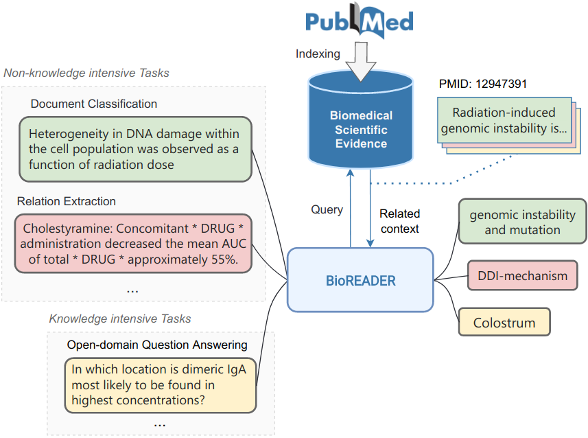
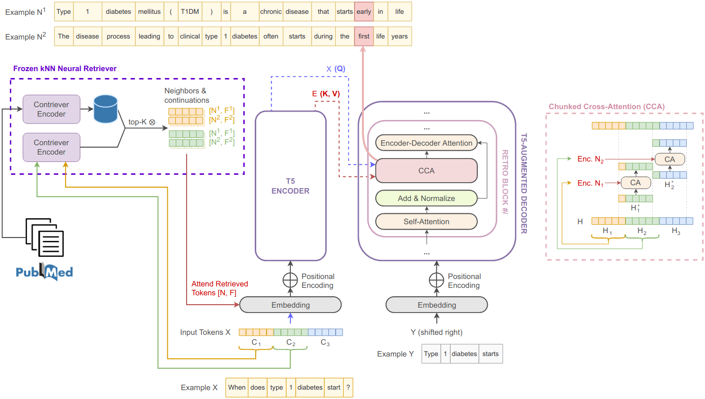
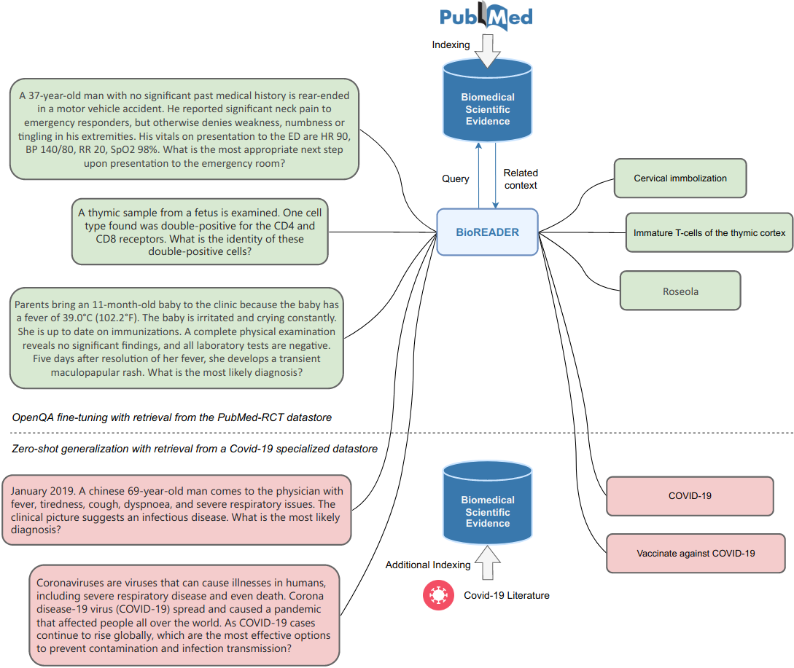

# BioReader

Public repository accompanying the EMNLP22 long paper "BioReader: a Retrieval-Enhanced Text-to-Text Transformer for Biomedical Literature".

BioReader is the first retrieval-enhanced text-to-text model for biomedical natural language processing. By relying on T5 and RETRO blocks, our solution augments the input prompt by fetching and assembling relevant scientific literature chunks from a neural database with ≈60 million tokens centered on PubMed. We fine-tune and evaluate BioReader on a broad array of downstream tasks, significantly outperforming several state-of-the-art methods despite using up to 3x fewer parameters.

  

  

In tandem with extensive ablation studies, we show that domain knowledge can be easily altered or supplemented to make the model generate correct predictions bypassing the retraining step and thus addressing the literature overload issue; we coin the term "zero-shot datastore".

  

<!-------------------------------------------------------------------------------->

## 🔎 Paper

Read our [paper](frisoni_mizutani_moro_valgimigli_EMNLP2022.pdf)

<!-------------------------------------------------------------------------------->

## ✉ Contacts

* Giacomo Frisoni, [giacomo.frisoni[at]unibo.it](mailto:giacomo.frisoni@unibo.it)
* Miki Mizutani, [miki.mizutani[at]studio.unibo.it](mailto:miki.mizutani[at]studio.unibo.it)
* Gianluca Moro, [gianluca.moro[at]unibo.it](mailto:gianluca.moro@unibo.it)
* Lorenzo Valgimigli, [lorenzo.valgimigli[at]unibo.it](mailto:lorenzo.valgimigli[at]unibo.it)

<!-------------------------------------------------------------------------------->

## Cite

If you find BioReader helpful in your research, please cite:

    @article{frisoni-etal-2022-bioreader,
      title     = {BioReader: a Retrieval-Enhanced Text-to-Text Transformer for Biomedical Literature},
      author    = {Giacomo, Frisoni and Miki, Mizutani and Gianluca, Moro and Lorenzo, Valgimigli},
      booktitle = {{EMNLP}},
      pages     = {1--24},
      publisher = {Association for Computational Linguistics},
      year      = {2022}
    }
